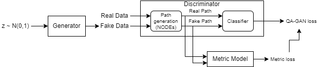

# Metric_ODE_GAN

GAN with ODE layer and Metric learning

Discriminator of GAN learns difference of trajectory of ode between real and fake data. Metric learning helps those works with Banach loss term.

Base study and experiments are in [notion site](https://www.notion.so/CTGAN-ODE_Metric-4c6bd4702db945aa95476b3047bbff72)

